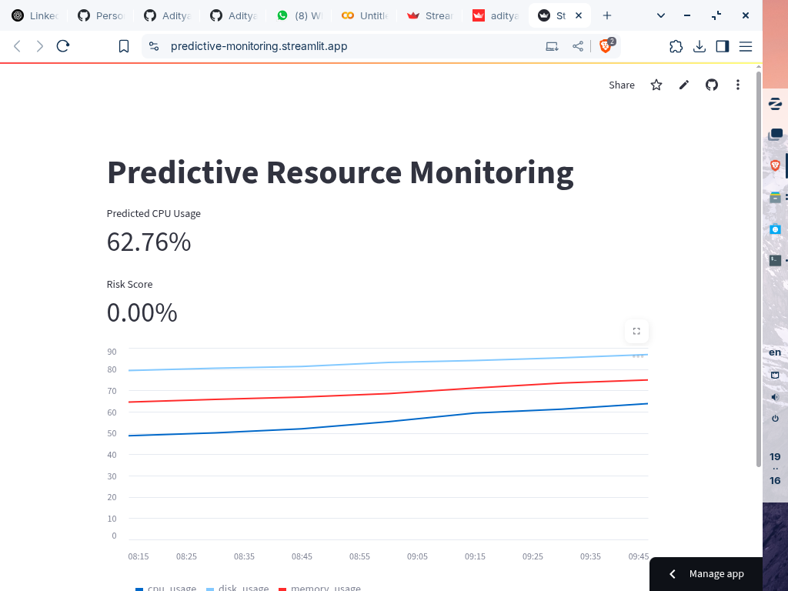

# Predictive Resource Monitoring

A lightweight ML-powered monitoring dashboard that forecasts CPU usage based on historical data and highlights risk levels in real-time.  
Built with **Streamlit**, **Scikit-learn**, and **Pandas**, it uses a simple `RandomForestRegressor` model to anticipate server load before it becomes critical.

---

##  Dashboard Preview



---

##  Included Files
- `predictive_monitoring_app.py`: Main dashboard app
- `usage_metrics.csv`: Sample metric data (timestamp, cpu, memory, disk)

---

##  How to Run

```bash
pip install streamlit pandas scikit-learn joblib
streamlit run predictive_monitoring_app.py
